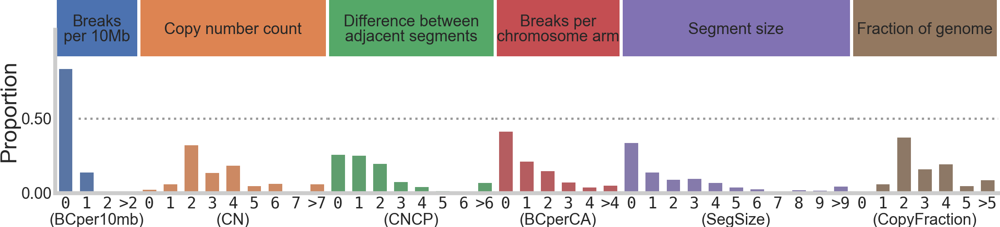
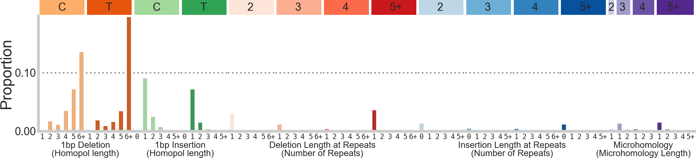
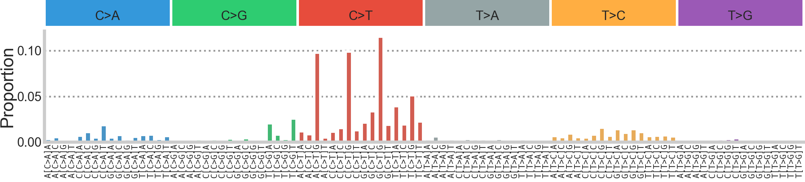
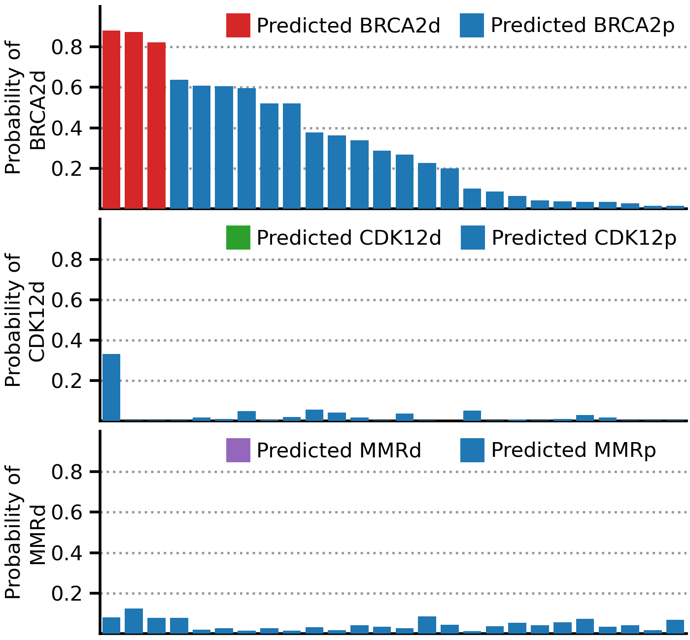
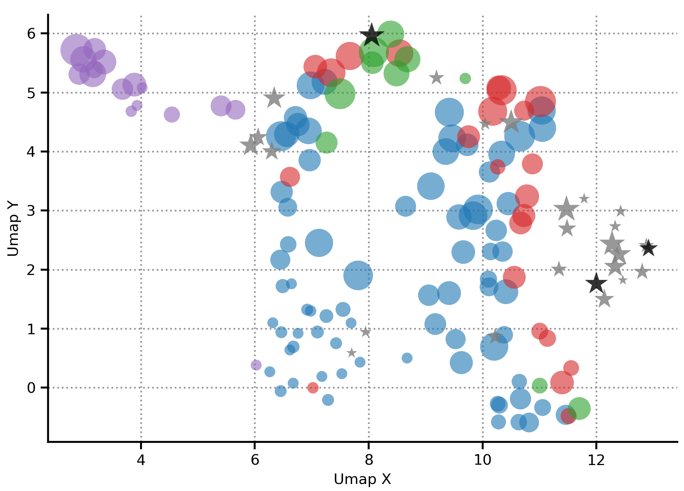

# DARC Sign (DnA Repair Classification Signatures)

### *Note: This repository accompanies the publication "A generalizable machine learning framework for classifying DNA repair defects using ctDNA exomes". It is meant to ensure reproducibly of the publication and fascilate the use of the "DARC Sign" package to predict DNA repair defects for research and/or clinical applications.*
## This tool includes the generation of signatures from standard maf and seg files and trained XGBoost models that use the features.


This repository contains the processing steps required to generate features needed to train new models, to classify a sample as BRCA2d, CDK12d or MMRd and to reproduce the publication. The directory structure includes:
- The data used to train the models and all other supplemental data is located in `./data`.
- Figures and associated code from the publication are reproduced in `./figures`
- Code that was used to find optimal hyperparemeters of each model is located in `./model_training_gridsearchcv`
- The data pipeline for predicting a sample can be run through the script `./darcsign_predict.py` which calls various functions and files in `./darc_sign_pipeline`.

## Installation
The installation has been tested with python >3.7 and xgboost >1.0
All python dependencies can be installed via conda
```bash
#this version is using xgboost=1.5.0 and python=3.9.7
conda create --name darcsign_env --yes numpy scipy pandas matplotlib seaborn scikit-learn pysam xgboost; 
```
The current version of this pipeline uses the tns and indel features generated by SigProfilerMatrixGenerator which needs to be installed into the created environment:
```bash
#activate environment
conda activate darcsign_env;
#Then install SigProfilerMatrixGenerator via pip
pip install SigProfilerMatrixGenerator;
#sigprofiler reference genome also needs to be installed. This tool uses GRCh38
python -c "from SigProfilerMatrixGenerator import install as genInstall; genInstall.install('GRCh38', rsync=False, bash=True)"
```
Download this repository and the xgboost models on figshare
```bash
# clone form get or wget
git clone https://github.com/elieritch/DarcSign.git;
#download and extract model directory from figshare ~65mb
cd DarcSign; 
wget https://figshare.com/ndownloader/files/34540430 -O models.tar.gz; 
tar -xzvf models.tar.gz;
rm models.tar.gz;
```

## Running the classifier

### Inputs: The pipeline takes as input a maf (mutation annotation file) and a sequenza segments file. Examples of these files can be found in `./darc_sign_pipeline/test_data_input`. 
In the maf file, the columns needed and the number of the column are:

| Column Number |          Column                |
|---------------|--------------------------------|
|     #2        |     Chromosome (1,2,...X,Y)    |
|     #3        |     Position (int)             |
|     #5        |     Reference sequence (str)   |
|     #6        |     Alternate sequence (str)   |

The names in this table do not matter, the column numbers do. This maf file is converted into a vcf with an awk command called through a subprocess to convert the file into a vcf usable by SigProfilerMatrixGenerator ie.. 
```python
cmd = f"tail -n +2 {mafpath} | awk \'BEGIN{{FS=OFS=\"\\t\"}} {{print $2,$3,\".\",$5,$6,\".\", \".\", \".\"}}\' >> {vcffile}"
subprocess.call(cmd, shell=True)
```
One of the products of the sequenza pipeline is a file with the suffix "_segments.txt". This is the other input to the DARC Sign pipeline. Other segmentation data other than Sequenza could also be used but requires the same 4 named columns. The columns that are used from this file are:
| Column Name |  Column                           |
|-------------|-----------------------------------|
| chromosome  |  Chromosome (1,2,...X,Y)          |
| start.pos   |  Start position of segment (int)  |
| end.pos     |  End position of segment (int)    |
| CNt         |  Copy number tumor (int)          |

For the exact commands of how sequenza was run for this project to create this file, they are located in `DarcSign/darc_sign_pipeline/sequenza_slurm_pipeline/`

The directory also contains a centromere position defining file downloaded from http://hgdownload.cse.ucsc.edu/goldenPath/hg38/database/cytoBand.txt.gz which is used for feature calculation.

### Running the classifier on sample using `./darcsign_predict.py`:
```bash
seg_file="/path/to/samplename_segments.txt"; #product of sequenza
maf_file="/path/to/samplename.maf"; #product of circuit variant caller or other variant calling tools
output_directory="/path/to/samplename_directory"; #directory will be created if doesnt already exist
sample_name="samplename"; #will be used in figure titles and in the nameing of files 
script="/path/to/darcsign_predict.py"; #from this git repo
#activate appropriate environment
conda activate darcsign_env;
#run the script
python ${script} -m ${maf} -s ${seg} -od ${od} -sn ${sn}
```

## Output interpretation

### Outputs: The pipeline produces several figures and tables as output. Examples of these files can be found in `./darc_sign_pipeline/test_data_input`. The output of the tool includes the following files:
The processed set of features extracted from the input data:
- {samplename}_{kindoffeature}_matrix.tsv which include the raw values of each feature that is used as the input of Darc Sign.
  - `./darc_sign_pipeline/test_data_output/sample_name/sample_name_cnv45feature_matrix.tsv`
  - `./darc_sign_pipeline/test_data_output/sample_name/sample_name_snv96feature_matrix.tsv`
  - `./darc_sign_pipeline/test_data_output/sample_name/sample_name_ndl83feature_matrix.tsv`

## Graphs of the feature values as proportions of their feature sets




## A table that specifies the sample name and the probability of each deficiency

|   sample   | prob_of_BRCA2d | prob_of_CDK12d | prob_of_MMRd |
|------------|----------------|----------------|--------------|
| sample_010 |    0.881962    |   0.33209658   | 0.081173204  |

## Reproducing the publication
Each subdirectory of `./figures` contains python scripts and the figures generated by each script. Each figure calls data from the publication which can be found in `./data`. The scripts are all run in place using paths relative to their respective hierarchical locations and can be run using the same conda environment as previously installed. eg: the script DarcSign/figures/fig4/predict_and_graph_bc.py produces these graphs and the associated legends.

Figure 4B                            |  Figure 4C                                                  
:-----------------------------------:|:--------------:
 | 

## Reference
In review...
